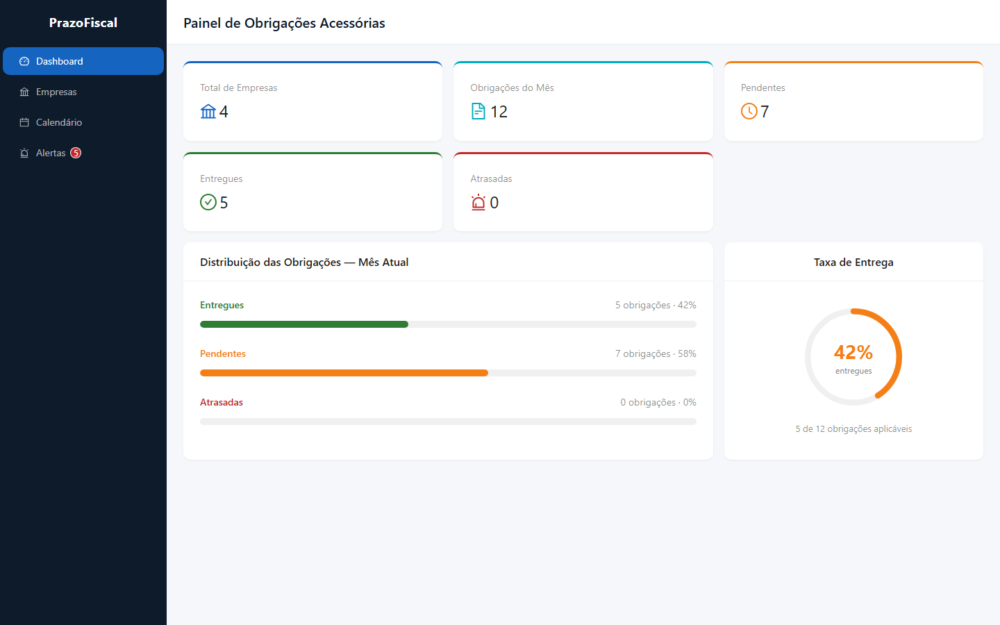
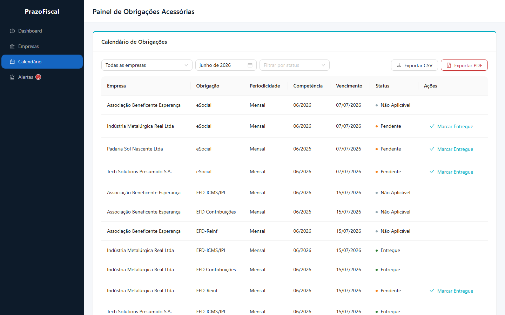
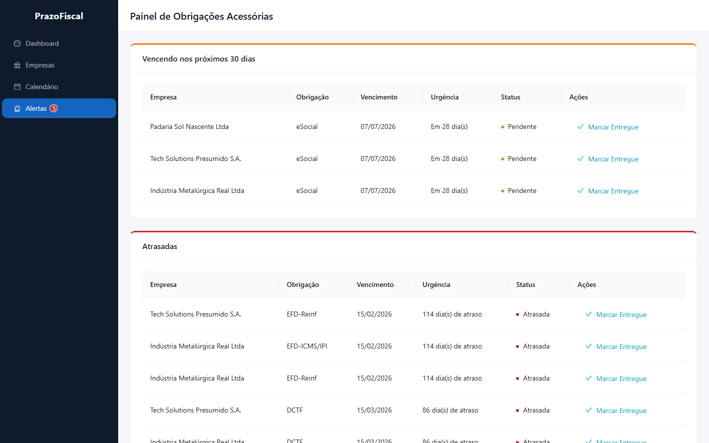
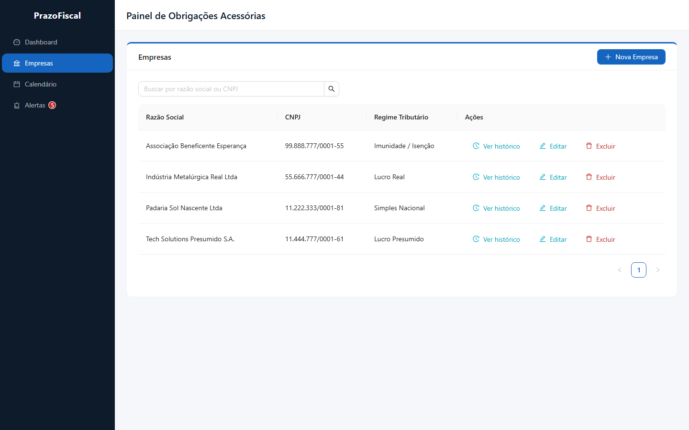

# prazo-fiscal

[](https://github.com/rtsemensato/prazo-fiscal/actions/workflows/ci.yml)

Painel web para gestão de obrigações acessórias fiscais — React, .NET 9, PostgreSQL.

## Screenshots

| Dashboard | Calendário de Obrigações |
|:---------:|:------------------------:|
|  |  |

| Alertas | Gestão de Empresas |
|:-------:|:------------------:|
|  |  |

## Estrutura do repositório

```
prazo-fiscal/
├── backend/
│   ├── PrazoFiscal.Api/       # API .NET 9 (Minimal APIs)
│   ├── PrazoFiscal.Tests/     # Testes unitários + integração
│   └── PrazoFiscal.sln
├── frontend/                  # React + Vite + Ant Design
└── docker-compose.yml         # Sobe postgres + api + frontend
```

## Subir com Docker Compose (recomendado)

Pré-requisito: Docker Desktop.

```bash
docker compose up --build
```

| Serviço    | URL                        |
|------------|----------------------------|
| Frontend   | http://localhost:5173      |
| API        | http://localhost:5000      |
| Scalar UI  | http://localhost:5000/scalar/v1 |
| PostgreSQL | localhost:5432             |

Ao subir, a API aplica migrations e popula o banco com dados de demonstração (4 empresas).

## Desenvolvimento local

### Backend

Pré-requisitos: .NET 9 SDK, PostgreSQL 16.

```bash
cd backend/PrazoFiscal.Api
dotnet ef database update
dotnet run
```

API em http://localhost:5000

Variável de conexão (padrão em `appsettings.json`):

```
ConnectionStrings__DefaultConnection=Host=localhost;Port=5432;Database=prazofiscal;Username=postgres;Password=postgres
```

### Frontend

```bash
cd frontend
npm install
npm run dev
```

Copie o arquivo de exemplo e ajuste se necessário:

```bash
cp frontend/.env.example frontend/.env
```

Frontend em http://localhost:5173

### Testes

```bash
# Engine de regras + integração API (Testcontainers)
cd backend
dotnet test

# Frontend
cd frontend
npm test
```

**Cobertura de testes:**

- **Backend**: `ObligationEngineTests` (engine de regras — regimes × obrigações × vencimentos × edge cases de fim de semana e meses anuais) + `ApiIntegrationTests` (endpoints reais via `WebApplicationFactory` + Testcontainers PostgreSQL): criação/edição/deleção com cascata, filtros do calendário por empresa e status, fluxo completo de registro de entrega com verificação do status atualizado, validação de vencimentos end-to-end, alertas com verificação das duas seções.
- **Frontend**: utilitários (`cnpj.test.ts`) e **testes de componente** com React Testing Library + TanStack Query + Ant Design renderizado de verdade:
  - `AlertsPage`: listagem separada de "vencendo em 30 dias" / "atrasadas", estado vazio, e fluxo completo de marcar uma obrigação como entregue (abrir modal → confirmar → disparar mutação).
  - `CalendarPage`: renderização da tabela, filtro por status refletido na query (`getCalendarObligations`), exportação CSV (URL gerada corretamente) e fluxo de registro de entrega via modal.
  - A API é mockada (`vi.mock`) para isolar os componentes da rede; o `QueryClientProvider`/`ConfigProvider` reais são usados via `renderWithProviders` (`src/test/renderWithProviders.tsx`), garantindo que hooks de query e componentes antd se comportem como em produção.

## Endpoints da API

| Método | Rota | Descrição |
|--------|------|-----------|
| GET | `/api/companies?search=` | Listar empresas |
| POST | `/api/companies` | Criar empresa |
| PUT | `/api/companies/{id}` | Atualizar empresa |
| DELETE | `/api/companies/{id}` | Remover empresa |
| GET | `/api/companies/{id}/deliveries` | Histórico de entregas da empresa |
| GET | `/api/obligations/calendar` | Calendário de obrigações |
| GET | `/api/obligations/calendar/export` | Exportar calendário em CSV |
| POST | `/api/obligations/{id}/deliveries` | Registrar entrega |
| GET | `/api/dashboard` | KPIs do mês |
| GET | `/api/alerts` | Alertas (30 dias + atrasadas) |

Respostas seguem o padrão `{ success, message?, data }` em camelCase. Erros de validação retornam ProblemDetails RFC 7807 (422).

## Regras de negócio (resumo)

### Regimes × obrigações

| Obrigação | Simples | L. Presumido | L. Real | Imunidade |
|-----------|:-------:|:------------:|:-------:|:---------:|
| DAS | ✓ | — | — | N/A |
| DEFIS | ✓ | — | — | N/A |
| DCTF | — | ✓ | ✓ | N/A |
| EFD-ICMS/IPI | — | ✓ | ✓ | N/A |
| EFD Contribuições | — | ✓ | ✓ | N/A |
| EFD-Reinf | — | ✓ | ✓ | N/A |
| SPED ECD | — | ✓ | ✓ | N/A |
| SPED ECF | — | ✓ | ✓ | N/A |
| eSocial | ✓ | ✓ | ✓ | N/A |
| DIRF | ✓ | ✓ | ✓ | N/A |
| RAIS | ✓ | ✓ | ✓ | N/A |

Obrigações anuais aparecem apenas na competência de **janeiro**. Imunidade/isencão gera todas as linhas como **Não Aplicável**.

### Formato do `obligationId`

Identificador composto gerado pela engine:

```
{companyId}-{tipoCamelCase}-{competenceMonth}-{competenceYear}
```

Exemplo: `11111111-1111-1111-1111-111111111111-esocial-6-2026`

## Diferenciais implementados

| Diferencial (PDF) | Status |
|-------------------|--------|
| Geração on-demand de obrigações | ✓ |
| Filtro por status no calendário | ✓ |
| Histórico de entregas por empresa (timeline) | ✓ |
| Exportação CSV do calendário | ✓ |
| Testes de integração nos endpoints | ✓ |
| Exportação PDF do calendário | ✓ (QuestPDF — relatório A4 paisagem com paleta e-Auditoria, sumário no rodapé) |
| Edição de empresa (não listado no PDF) | ✓ — decisão documentada abaixo |

## Decisões técnicas

### Arquitetura

- **Minimal APIs** com endpoint groups por feature, menos boilerplate que Controllers para o escopo do case.
- **Camadas**: Domain → Application (Services + Rules) → Infrastructure → Endpoints.
- **Obrigações computadas**: o calendário é determinístico (regime + competência); apenas entregas são persistidas.
- **ObligationEngine**: classe pura, testável, sem dependência de EF Core. É o coração das regras do PDF.

### Ambiguidades identificadas na especificação

O PDF menciona explicitamente que ambiguidades intencionais fazem parte do processo. As que identifiquei e as decisões que tomei:

- **Alertas de obrigações anuais fora de janeiro**: a spec não define se DEFIS, DIRF, SPED ECD etc. devem aparecer nos alertas após o vencimento em meses que não janeiro. Decidi que sim: uma obrigação atrasada é atrasada independente do mês em que estamos. O dashboard, por outro lado, mantém KPIs apenas do mês corrente (comportamento esperado para um painel de controle diário).
- **"Ordenadas por urgência" nos alertas**: sem critério definido. Interpretei como ordenação crescente por data de vencimento, ou seja, o que vence antes aparece primeiro.
- **Imunidade/Isenção: quais obrigações são dispensadas**: a spec diz "dispensadas da maioria das obrigações fiscais" sem listar quais. Optei por tratar todas as obrigações como Não Aplicável para esse regime. É o comportamento mais conservador e correto para o contexto de um escritório contábil, onde mostrar uma obrigação indevida causa mais problema do que omitir uma.

### Alertas cross-mês

Alertas e atrasadas incluem obrigações **anuais de janeiro** mesmo fora desse mês, para que DEFIS, DIRF, SPED etc. continuem visíveis após o vencimento. O dashboard mantém KPIs apenas do mês corrente.

### Busca de empresas

Query string `search` aceita razão social ou CNPJ. Filtro por CNPJ só é aplicado quando há dígitos na busca (evita falso positivo com string vazia).

### Estrutura de pastas

**Backend** (layer-based, alinhado à sugestão de Clean Architecture do PDF):

```
PrazoFiscal.Api/
├── Domain/           # Entidades e enums — sem dependências externas
├── Application/
│   ├── Rules/        # ObligationEngine — lógica pura, sem EF Core
│   ├── Services/     # Casos de uso (CalendarService, DashboardService…)
│   ├── Interfaces/   # Contratos dos services
│   └── Mappers/      # Domain → DTO
├── Infrastructure/
│   └── Data/         # AppDbContext, migrations, seed
├── Common/
│   ├── Errors/       # AppExceptionHandler (ProblemDetails)
│   └── Helpers/      # ObligationIdParser
├── DTOs/             # Request/response shapes
└── Endpoints/        # Minimal API endpoints agrupados por feature
```

**Frontend** (arquitetura híbrida: layer-based para infraestrutura compartilhada, feature-based para as views):

```
src/
├── api/fiscalService/   # Axios client + funções de chamada à API
├── components/          # Componentes reutilizáveis (QueryErrorAlert, FormErrorAlert…)
├── hooks/queries/       # TanStack Query hooks — um por recurso
├── models/              # Tipos TypeScript (ApiError, obligation, company…)
├── pages/               # Uma pasta por página, com subcomponentes co-localizados
├── store/               # Zustand stores de UI (filtros, estado de modal)
└── utils/               # Funções puras (cnpj, dates, errorHandling)
```

A co-localização de subcomponentes em `pages/<Feature>/components/` evita que componentes específicos de uma tela poluam a pasta `components/` global.

### Tratamento de erros

**Backend**: o `AppExceptionHandler` (implementa `IExceptionHandler`) centraliza o mapeamento de exceções para ProblemDetails RFC 7807:

| Exceção | Status HTTP |
|---|---|
| `ApiValidationException` (FluentValidation) | 422 com objeto `errors` por campo |
| `KeyNotFoundException` | 404 |
| `InvalidOperationException` | 409 Conflict |
| `FormatException` / `BadHttpRequestException` | 400 |
| Qualquer outra | 500 (mensagem genérica; detalhe logado via Serilog) |

Erros 5xx são logados com `_logger.LogError(exception, ...)` e não expõem stack trace ao cliente.

**Frontend**: o interceptor Axios em `client.ts` converte toda resposta de erro em `ApiError` tipado antes de chegar às mutations. A categorização determina onde o erro é exibido:

- **422 (validação de campo ou regra de negócio) e 409**: exibidos **inline** no modal que originou a ação, via `<FormErrorAlert>`. Modal permanece aberto, sem toast.
- **404 / 500 / erro de rede**: `toast.error` com a mensagem `detail` da API, para erros de infraestrutura que o usuário não pode resolver no contexto atual.

### Design system

Paleta baseada na referência da e-Auditoria (seção 4.3 do PDF), centralizada em `src/styles/theme.ts` e aplicada via `ConfigProvider` do Ant Design:

| Token | Hex | Onde aparece |
|---|---|---|
| `primary` | `#1565C0` | Botões primários, links |
| `navy` | `#0D1B2A` | Sidebar, header |
| `accent` | `#00ACC1` | Borda superior dos cards |
| `success` | `#2E7D32` | Status Entregue |
| `warning` | `#F57F17` | Status Pendente, alertas de prazo próximo |
| `error` | `#C62828` | Status Atrasada, erros |

Os três status de obrigação (Entregue / Pendente / Atrasada) usam exatamente essas cores, criando um vocabulário visual consistente em todas as telas. Calendário, alertas e dashboard usam os mesmos tokens sem exceção.

### Edição de empresa

O spec define "Cadastrar, listar e remover", sem mencionar edição. Decidi incluir o `PUT /api/companies/{id}` porque num sistema real nenhuma interface de gestão de cadastro omite edição, e a ausência dela criaria uma percepção de incompletude independente do spec. O custo foi baixo (endpoint + modal reutilizando o mesmo formulário de criação), e o risco de conflito com as regras de negócio é nulo: editar nome ou regime não tem impacto nas entregas já registradas, apenas recalcula o status das obrigações futuras.

### Histórico de entregas: Generate por entrega vs. por competência

`GetDeliveriesAsync` chama `ObligationEngine.Generate()` uma vez por entrega registrada, em vez de agrupar as entregas por competência (mês/ano) e chamar `Generate()` uma vez por grupo. A versão agrupada seria algoritmicamente mais eficiente, reduzindo de O(n_entregas) para O(n_competências) chamadas ao engine.

Não faz sentido otimizar aqui no escopo atual. A `Generate()` roda puramente em memória, e mesmo no pior caso realista do case (uma empresa com 10 anos de histórico completo) seriam ~600 chamadas de microssegundos, totalizando poucos milissegundos. O endpoint é carregado sob demanda ao clicar em uma empresa específica, não em listagens ou dashboards. Por fim, a versão agrupada exigiria um `GroupBy` + `SelectMany` aninhado que adiciona complexidade de leitura sem benefício perceptível no volume esperado.

Se o sistema crescesse para empresas com décadas de histórico e o endpoint passasse a ser chamado com frequência (ex.: relatórios batch), a refatoração seria justificada.

### Paginação no calendário

A tabela de obrigações usa paginação client-side (Ant Design Table, `pageSize: 15`) em vez de paginação server-side na API. O volume máximo realista do calendário não justifica mais do que isso: filtrado por mês, o resultado é limitado a `empresas × obrigações_do_regime`. Para 40 CNPJs com o regime mais amplo (Lucro Real, 11 obrigações mensais), o teto é ~440 linhas por requisição. Esse volume retorna em ~2ms e trafega em poucos KB, então cursor/offset na API seria over-engineering para o escopo do case.

Se o sistema crescesse para milhares de empresas, a abordagem correta seria mover o filtro de mês para o banco (`WHERE competence_month = ? AND competence_year = ?`) e adicionar paginação server-side. Isso também exigiria persistir as obrigações computadas, o que muda o modelo de dados fundamentalmente.

### Botão "Limpar filtros" no calendário

O calendário tem três filtros independentes (empresa, mês e status). Sem um atalho para resetar, o usuário precisaria limpar cada um separadamente para voltar à visão padrão. Adicionei um botão "Limpar filtros" que aparece ao lado do filtro de status e reseta os três de uma vez: empresa volta para "Todas", mês volta para o mês atual e o filtro de status é removido.

O botão fica desabilitado quando todos os filtros já estão no padrão, evitando clique sem efeito. O reset usa `dayjs()` no momento da ação (não o valor capturado na inicialização do store), então funciona corretamente mesmo que o usuário fique com a aba aberta da virada do mês.

### Regras de negócio duplicadas no frontend (modo mock)

`src/utils/obligationRules.ts` replica a `ObligationEngine` do backend exclusivamente para o modo `VITE_USE_MOCK=true`. A fonte de verdade é sempre o backend; o arquivo frontend existe para que o mock retorne dados coerentes sem depender de uma API rodando.

O risco é divergência silenciosa: se as regras fiscais mudarem no backend, o arquivo frontend precisa ser atualizado manualmente. A alternativa é [MSW (Mock Service Worker)](https://mswjs.io/), que intercepta chamadas HTTP e retorna fixtures estáticos, sem replicar lógica. MSW eliminaria esse risco ao custo de manter dados de fixture representativos. Para o escopo deste projeto, a duplicação é aceitável: o mock é usado apenas em dev/testes de componente, e o CI sempre valida contra a API real, então divergências seriam detectadas antes de ir para produção.

### Por que sem repositório

Duas entidades simples (`Company`, `ObligationDelivery`) com lógica computada no engine. A camada de abstração não agregaria valor neste escopo.

### Dashboard: gráfico de distribuição

O dashboard exibe dois blocos abaixo dos KPIs: barras de progresso horizontais (Entregues / Pendentes / Atrasadas como percentual das obrigações aplicáveis do mês) e um círculo de taxa de entrega. A cor do círculo muda dinamicamente: verde em 100%, ciano acima de 50%, âmbar abaixo disso. O denominador usa apenas obrigações aplicáveis (`pendente + entregue + atrasada`), excluindo as Não Aplicável, já que incluí-las distorceria a taxa para baixo em empresas com regime de Imunidade. Todos os dados vêm do endpoint `/api/dashboard` já existente, sem request adicional.

### Seed automático

`DatabaseSeeder` popula 4 empresas (Simples, Presumido, Real, Imunidade) com entregas cobrindo todos os estados possíveis, executado no startup após migrations via `MigrateAndSeedAsync`.

O seed é idempotente (`if (await dbContext.Companies.AnyAsync()) return;`) e construído para demonstrar cada tela do sistema:

- **Mês atual**: Padaria com DAS entregue; Tech e Industria com EFDs entregues; eSociais pendentes para todos (alertas de "vencendo em 30 dias").
- **Janeiro**: Padaria com todas as mensais entregues (empresa modelo); Tech e Industria apenas com eSocial entregue. DCTF e EFDs deliberadamente sem entrega para aparecerem como **Atrasadas** e ativar o badge no menu.
- **Imunidade**: sem entregas (todas as obrigações são Não Aplicável).

Todos os `DateTime` usam `DateTimeKind.Utc` explícito via helper `Utc(year, month, day)`. O Npgsql rejeita `Kind=Unspecified` em colunas `timestamp with time zone`.

### Performance

- **Sem N+1**: `CalendarService` e `DashboardService` carregam empresas e entregas em **uma única query** (`AsNoTracking().Include(c => c.Deliveries)`), e todo o cálculo de obrigações/vencimentos roda em memória via `ObligationEngine`, sem queries adicionais por empresa ou por obrigação.
- **Observabilidade**: `UseSerilogRequestLogging()` registra automaticamente o tempo de cada requisição.
- **Medição real** (ambiente local via `docker compose up --build`, banco já com seed, medido com `curl -w`):

  | Endpoint | Tempo no servidor (log Serilog) | Tempo total (cliente, incl. rede) |
  |---|---|---|
  | `GET /api/companies` | ~1.4 ms | ~4 ms |
  | `GET /api/obligations/calendar?month=6&year=2026` | ~1.8 ms | ~4 ms |
  | `GET /api/dashboard` | ~1.6 ms | ~4 ms |
  | `GET /api/alerts` | ~1.5 ms | ~3 ms |
  | `GET /api/obligations/calendar/export` (CSV) | ~9 ms | ~11 ms |

  Todos os endpoints ficam **bem abaixo dos 500 ms** exigidos, mesmo com o cálculo de obrigações sendo feito em tempo de requisição (geração on-demand, sem pré-cálculo persistido).

## Diretrizes do projeto

O arquivo [`CLAUDE.md`](CLAUDE.md) na raiz do repositório documenta os invariantes técnicos, convenções de código e decisões arquiteturais que devem ser mantidas à medida que o projeto cresce. Cobre desde contratos obrigatórios (formato do `obligationId`, tratamento de `DateTime` UTC, categorização de erros da API) até o que deliberadamente *não* foi abstraído e por quê.

À medida que novos desenvolvedores entram no projeto ou novas features são adicionadas, manter esse documento atualizado é tão importante quanto manter os testes passando: é o que garante que as decisões tomadas com contexto não sejam desfeitas por quem não tinha esse contexto.

## Stack

| Camada | Tecnologia |
|--------|------------|
| Frontend | React 19, Vite, TypeScript, Ant Design, TanStack Query, Zustand |
| Backend | .NET 9, Minimal APIs, EF Core, FluentValidation, Serilog |
| Banco | PostgreSQL 16 |
| Testes | xUnit + FluentAssertions + Testcontainers (backend), Vitest (frontend) |
| Container | Docker Compose |

## Uso de IA

Usei Claude Code (via Cursor) como par de programação durante todo o desenvolvimento. Basicamente, eu ficava responsável pela arquitetura, pelas decisões de produto e pela revisão antes de commitar. A IA acelerou bastante os ciclos de implementação, mas não substituiu julgamento. Abaixo os pontos onde isso ficou mais evidente.

### O que foi gerado sem retrabalho relevante

- Estrutura do mono-repo: Docker Compose, camadas .NET 9, setup TypeScript/Vite. Acertou de primeira.
- Scaffold das quatro páginas React com hooks TanStack Query. A estrutura saiu correta; só ajustei detalhes de UX depois.
- Testes de integração com `WebApplicationFactory` + Testcontainers. Gerou correto, passou sem ajuste.
- Pipeline de CI no GitHub Actions (4 jobs: backend, frontend, Docker smoke, E2E). Funcionou na primeira execução.

### Onde precisei corrigir ou tomar a decisão

**Solução desnecessariamente complexa para parsing de enum**

Um 500 em `GET /calendar?status=delivered` foi resolvido com uma classe `EnumParsing.cs` que usava `JsonNamingPolicy.CamelCase`. Reconheci que era engenharia desnecessária para um problema que o .NET resolve em uma linha:

```csharp
Enum.TryParse<ObligationStatus>(value, ignoreCase: true, out var status)
```

Descartei a classe antes de commitar. A IA não chegou à solução mais simples por conta própria.

**Shadowing silencioso no FluentValidation**

A extensão `ValidateOrThrowAsync` foi gerada corretamente, mas nunca era chamada: o FluentValidation já expõe um método com o mesmo nome em `IValidator<T>`, então a extensão ficava oculta. A validação passava sem lançar nada. Só peguei na revisão manual. Não aparecia nenhum erro em tempo de compilação.

**`Contains("")` sempre verdadeiro na busca de empresas**

`CompanyService` filtrava CNPJ com `company.Cnpj.Contains(digits)`. Quando a busca era textual (sem dígitos), `digits` resultava em string vazia, e `Contains("")` retorna `true` para qualquer string, passando todos os registros. A guarda `!string.IsNullOrEmpty(digits)` resolve, mas a IA não havia incluído isso na geração original.

**Regra de negócio implícita nos alertas**

A IA implementou alertas só para o mês corrente. Durante os testes, percebi que obrigações anuais como DEFIS, DIRF e SPED ECD vencem em janeiro mas continuam atrasadas nos meses seguintes. Precisam aparecer nos alertas o ano inteiro, não só em janeiro. O PDF do case não deixa isso explícito; foi uma decisão de domínio que tomei e orientei na implementação.

**QuestPDF: dois bugs que só aparecem em tempo de compilação/execução**

Ao implementar a exportação em PDF com QuestPDF 2025.1.0:

1. `var bg = i % 2 == 0 ? Colors.White : SurfaceHex`: `Colors.White` é do tipo `Color` e `SurfaceHex` é `string`. O compilador rejeita a expressão ternária por tipos incompatíveis, mas a IA gerou sem perceber. Corrigi usando `"#FFFFFF"` no lugar de `Colors.White`.
2. `.BorderRadius(4)` foi gerado normalmente, mas esse método não existe na API do QuestPDF 2025. A IA estava baseada em versões anteriores da biblioteca. Simplesmente removi.

**Testes E2E com Playwright: seletores que não batiam com a UI real**

A IA gerou os specs com labels e nomes que não correspondiam ao que estava de fato na tela. Alguns exemplos que corrigi na mão:

- `"Empresas Cadastradas"` → `"Total de Empresas"` (texto real do KPI no dashboard)
- `"Padaria Sol Nascente"` → `"Padaria Sol Nascente Ltda"` (nome completo no seed)
- `.ant-popover-buttons` → `.ant-popconfirm-buttons` (classe correta do Popconfirm do Ant Design)
- `.ant-select.nth(2)` para o filtro de status → `nth(1)`, porque o DatePicker não renderiza com a classe `.ant-select`
- `getByText(nomeEmpresa)` resolvia para um `aria-live` span oculto que o Ant Design injeta no DOM, então troquei por `getByRole('row').filter({ hasText: nome })`

Esses erros são esperados: a IA gera os testes sem executar a aplicação, então não tem como saber o que está renderizado. O valor está na estrutura dos testes; a calibração contra a UI real é sempre trabalho manual.

**Decisão de UX: debounce vs. busca explícita**

A IA sugeriu debounce de 300ms, argumentando que o TanStack Query gerencia cancelamento via `AbortSignal`. Preferi busca explícita (Enter ou lupa): o usuário desse painel está digitando razão social ou CNPJ com intenção definida, e disparar requisições a cada tecla não agrega nada aqui. A IA implementou sem resistência quando expliquei o raciocínio.

**Badge de alertas quebrando legibilidade no menu**

Ao adicionar o badge de contagem de obrigações atrasadas no menu lateral, o componente `Badge` do Ant Design sobrescrevia a cor do texto do label, tornando "Alertas" ilegível no fundo escuro do sider. Percebi ao usar a interface. A correção foi desacoplar o badge do label, envolvendo o texto em `<span style={{ color: 'inherit' }}>` para herdar a cor do menu em vez de receber a do componente pai.

**Conflito de runners: Vitest coletando specs do Playwright**

Ao analisar a saída da pipeline de CI, percebi que o job do Vitest estava falhando com "Playwright Test did not expect test.describe() to be called here" em todos os specs E2E. Identifiquei a causa: o Vitest, por padrão, coleta qualquer arquivo `*.spec.ts` no projeto, inclusive os de `tests/e2e/**`. Esses arquivos importam `@playwright/test`, que registra um `test` global próprio e incompatível com o runner do Vitest. O CI já separava os jobs corretamente (`npm test` para o Vitest, `npm run test:e2e` para o Playwright), mas faltava dizer ao Vitest para não tocar nesses arquivos. Corrigi adicionando `exclude: ['**/tests/e2e/**']` no bloco `test` do `vite.config.ts` e deixei um comentário explicando o porquê, porque esse tipo de configuração silenciosa costuma confundir quem for manter o projeto depois.

**Seletores E2E frágeis após enriquecimento do dashboard**

Ao adicionar o gráfico de distribuição no dashboard, os textos "Pendentes", "Entregues" e "Atrasadas" passaram a existir em dois lugares no DOM (KPI cards e labels do Progress bar), causando _strict mode violations_ no Playwright. A correção inicial usou `.first()` nos locators. Funciona, mas é uma gambiarra que mascara a ambiguidade em vez de eliminá-la. A solução correta foi adicionar `data-testid` nos componentes (`kpi-pendentes`, `kpi-entregues`, etc.) e usar `getByTestId()` nos testes. O mesmo princípio foi aplicado ao calendário: em vez de `getByText('Padaria Sol Nascente Ltda').first()` (frágil, depende de qual empresa aparece no seed), o `beforeEach` passou a aguardar `getByTestId('calendar-table').locator('tbody tr').first()`, que testa o comportamento real (tabela com dados carregados) sem acoplar o teste a um nome específico.

**`aria-live` oculto do Ant Design Select sendo resolvido antes da célula da tabela**

Ao analisar a pipeline de CI, identifiquei que o teste "filtro por empresa" continuava falhando mesmo após a correção do `beforeEach`. O log mostrava: `locator resolved to <span aria-live="polite">Padaria Sol Nascente Ltda</span> - unexpected value "hidden"`. O Ant Design injeta um `<span aria-live="polite">` oculto no Select para acessibilidade. Como esse span aparece no DOM antes das células da tabela, o `.first()` o pegava em vez da célula visível. Corrigi trocando `getByText(...).first()` por `getByTestId('calendar-table').getByRole('cell', { name: ... }).first()`, que escopa a busca dentro da tabela e usa role semântico, eliminando qualquer chance de bater em elementos de UI do formulário.

**`Dictionary<TKey, DateTime>` com valor não-nullable mascarando ausência de entrega**

O `ObligationEngine` construía um dicionário de entregas com `DateTime` (não-nullable) como valor:

```csharp
var deliveryLookup = deliveries.ToDictionary(..., d => d.DeliveredAt);
```

Quando `TryGetValue` não encontrava a chave, retornava `DateTime.MinValue`. Ao atribuir esse valor a um `DateTime?`, o resultado tinha `HasValue = true`, e o `ResolveStatus` interpretava como "já entregue", marcando todas as obrigações como **Entregues**, inclusive as pendentes. O dashboard mostrava 100% de taxa de entrega independente dos dados reais.

A correção foi tipar o valor como `DateTime?` desde a criação do dicionário:

```csharp
var deliveryLookup = deliveries.ToDictionary(..., d => (DateTime?)d.DeliveredAt);
```

Assim, `TryGetValue` retorna `null` (não um `DateTime.MinValue` disfarçado) quando a obrigação não tem entrega registrada.

**Npgsql rejeitando `DateTime.Kind = Unspecified` ao registrar entregas**

O frontend envia a data no formato `"YYYY-MM-DD"` (sem timezone), que o `System.Text.Json` desserializa como `DateTime` com `Kind = Unspecified`. O Npgsql não aceita esse valor em colunas `timestamp with time zone` do PostgreSQL e lança exceção na tentativa de gravar.

Corrigi normalizando no serviço antes de qualquer acesso ao banco:

```csharp
deliveredAt = DateTime.SpecifyKind(deliveredAt, DateTimeKind.Utc);
```

A alternativa seria alterar o frontend para enviar um ISO 8601 completo com `Z`, mas a normalização no servidor é mais robusta: qualquer client que chame a API recebe o comportamento correto independente do formato enviado.

**EF Core relationship fixup causando chave duplicada no `ToDictionary`**

Em `CalendarService.RegisterDeliveryAsync`, após gravar uma nova entrega com `dbContext.ObligationDeliveries.Add(existingDelivery)`, o EF Core aplica _relationship fixup_ automaticamente: insere `existingDelivery` na coleção `company.Deliveries` do objeto rastreado em memória. O código original então passava `company.Deliveries.Append(existingDelivery)` para o `ObligationEngine.Generate`, o que duplicava o registro na sequência, e o `ToDictionary` lançava `ArgumentException` por chave duplicada.

Bastou remover o `.Append(existingDelivery)` e usar `company.Deliveries` diretamente, que já continha a entrega recém-adicionada pelo próprio EF Core.

**Botões de exportação agrupados no Calendário**

Os botões "Exportar CSV" e "Exportar PDF" eram filhos diretos do `<Space wrap>` externo que também continha os filtros. Isso os posicionava individualmente no fluxo, quebrando o alinhamento à direita esperado. Envolvi os dois em um `<Space>` interno, que os agrupa como uma unidade antes de o layout externo os posicionar.

**Tratamento estruturado dos erros da API (ProblemDetails RFC 7807)**

O frontend original ignorava a estrutura `{ title, detail, errors }` retornada pela API em erros 4xx/5xx. O `getErrorMessage` lia apenas `data.message` e qualquer falha virava `toast.error("Request failed with status code 422")`.

A solução foi tratada em três camadas:

1. **`ApiError` (modelo tipado)**: classe que encapsula `status`, `title`, `detail` e `fieldErrors`, com flags `isValidation` / `isBusinessRule` para classificar o tipo de erro. O interceptor do Axios converte toda resposta de erro em `ApiError` antes de propagar para as mutations.

2. **Categorização por tipo**:
   - **422 com `errors` (FluentValidation)**: mensagens de campo exibidas **inline** no modal via `<FormErrorAlert>`, sem toast. O modal permanece aberto.
   - **422 sem `errors` (regra de negócio)**: mesma abordagem inline, e o usuário vê "Esta obrigação não se aplica ao regime tributário da empresa." dentro do modal que originou a ação.
   - **404 / 500 / erro de rede**: `toast.error` com a mensagem `detail` da API (ex: "Empresa não encontrada.") em vez do texto técnico do Axios.

3. **Reset do estado de erro**: as mutations expõem `mutation.error` para os componentes pai. No cancelamento ou ao abrir o modal para uma nova obrigação, `deliveryMutation.reset()` é chamado explicitamente para limpar o erro anterior.

**Datas futuras bloqueadas no DatePicker de entrega**

O backend rejeitava datas futuras com 422. Adicionei `disabledDate={(current) => current.isAfter(dayjs(), 'day')}` no `DatePicker` do `DeliveryModal` para que o usuário simplesmente não consiga selecionar uma data futura, eliminando a necessidade de chegar à validação do servidor para esse caso específico.
